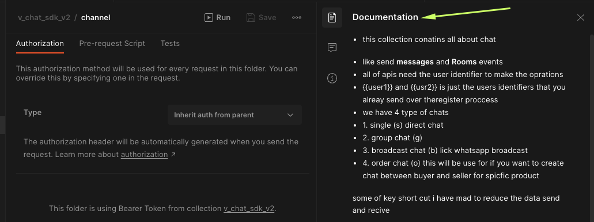
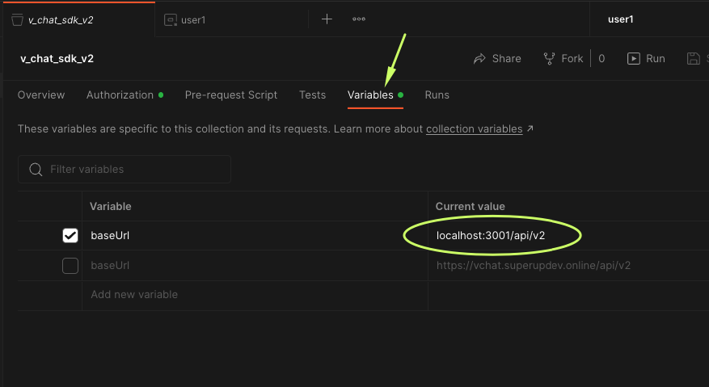

## Postman apis

- clone our postman collection from [here](https://documenter.getpostman.com/view/24524392/2s93Jox6Dq)
- all parameters all described there postman itself documents inside `v_chat_sdk_v2` collection
  
- there are global environment in postman you need to update the `baseUrl` to if development to `localhost:3001/api/v2`
  update the `3001` to your port see `IMAGE 1`
- if production put the real server ip contact with the port and `/api/v2`
- usually you don't do anything with postman but for make sure the apis works correctly you need to test at lest one
  endpoint
- `IMAGE 1`
  

## some important notes

1. `identifier` it can be string only if number then call.toString() To establish a link communication between your
   system and v_chat, we use an intermediate called an
   identifier. This identifier must be unique in your system, and we recommend using the user `ID` in your database
   system
   as the identifier.

- For example, when a user clicks on another user's name in v_chat, the default action is to open that user's page.
  However, this action should be handled outside of the v_chat scope, within your own system. To achieve this, we have
  created a callback function that passes the identifier to you, allowing you to handle the action of opening the peer
  user's page and loading their data.

- By using this identifier as the link between the two systems, you can seamlessly integrate the features of v_chat into
  your own system and provide a smooth user experience for your users. If you have any questions or need further
  assistance with the integration process, please don't hesitate to contact us.

## migrate old users

- there are plan to migrate your old users to v chat if you already do the chat in firebase then you can migrate or any
  platform
- you need to export all users in phases and import all to the mongo db collection named users the json must be with
  this format
- the system will migrate only after you restart the `node app` make sure you restart the app after any migrations
  happen

```json
[
  {
    "identifier": "YOUR STRING UNIQUE KEY FOR THIS USER THIS CAN BE THE ID IN YOUR DATABASE",
    "fullName": "user chat name",
    "userImages": {
      "fullImage": "https://super-up-dev.s3.eu-west-3.amazonaws.com/default_user_image.png",
      "chatImage": "https://super-up-dev.s3.eu-west-3.amazonaws.com/default_user_image.png",
      "smallImage": "https://super-up-dev.s3.eu-west-3.amazonaws.com/default_user_image.png"
    }
  },
  {
    "identifier": "YOUR STRING UNIQUE KEY",
    "fullName": "user chat name"
  }
]
```

- if you want to add user images add this add userImages key with the value with `full user image url`
- if you dont have or want to use the default image then delete the userImages key
- don't worry if you enter the same user twice v_chat will ignore it for you
- if in your system have one user image you can put it as same for all `fullImage` , `chatImage` , `"smallImage"`