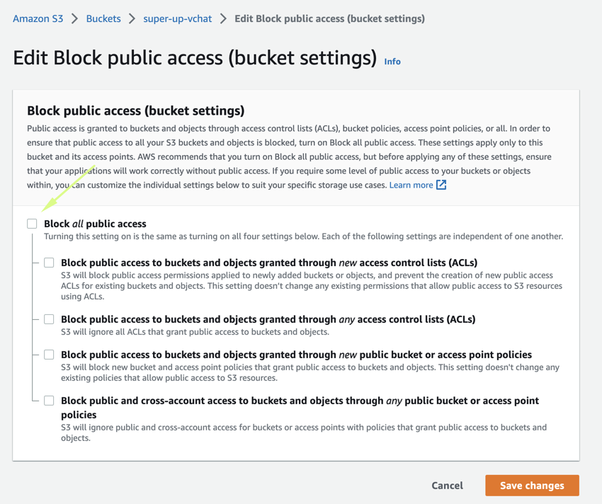
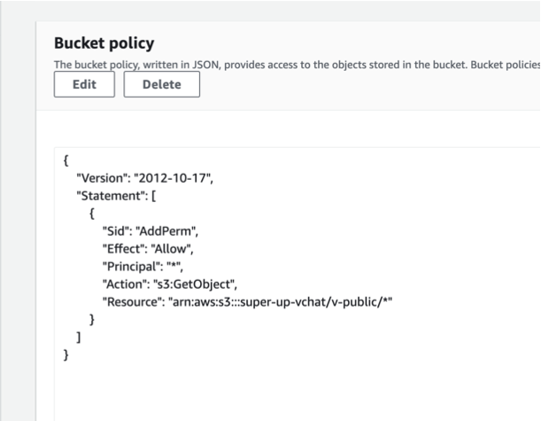

- after create new account in aws and create the bucket like this [Video](https://www.youtube.com/watch?v=NZElg91l_ms&t=585s) 
- select the bucket and make it `public` don't worry we will set `polity`
 
- uncheck all and save
- then scroll down and update `Bucket policy` set it 
```json
{
    "Version": "2012-10-17",
    "Statement": [
        {
            "Sid": "AddPerm",
            "Effect": "Allow",
            "Principal": "*",
            "Action": "s3:GetObject",
            "Resource": "arn:aws:s3:::BUCKET_NAME/v-public/*"
        }
    ]
}
```

- update `BUCKET_NAME` to your BUCKET_NAME and save this will only make `v-public` folder is public only
- scroll down again until see `Cross-origin resource sharing (CORS)`
- update value to 
```json
[
    {
        "AllowedHeaders": [
            "*"
        ],
        "AllowedMethods": [
            "GET",
            "PUT",
            "POST",
            "DELETE"
        ],
        "AllowedOrigins": [
            "*"
        ],
        "ExposeHeaders": [
            "x-amz-server-side-encryption",
            "x-amz-request-id",
            "x-amz-id-2"
        ],
        "MaxAgeSeconds": 3000
    }
]
```