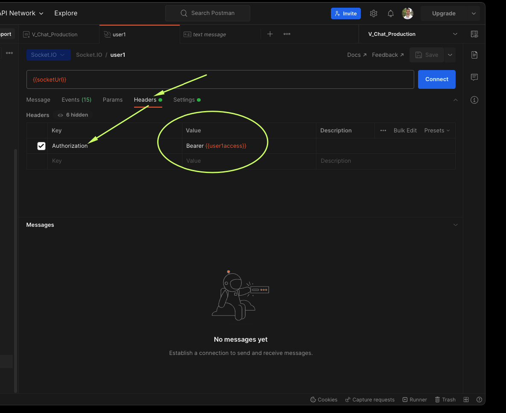
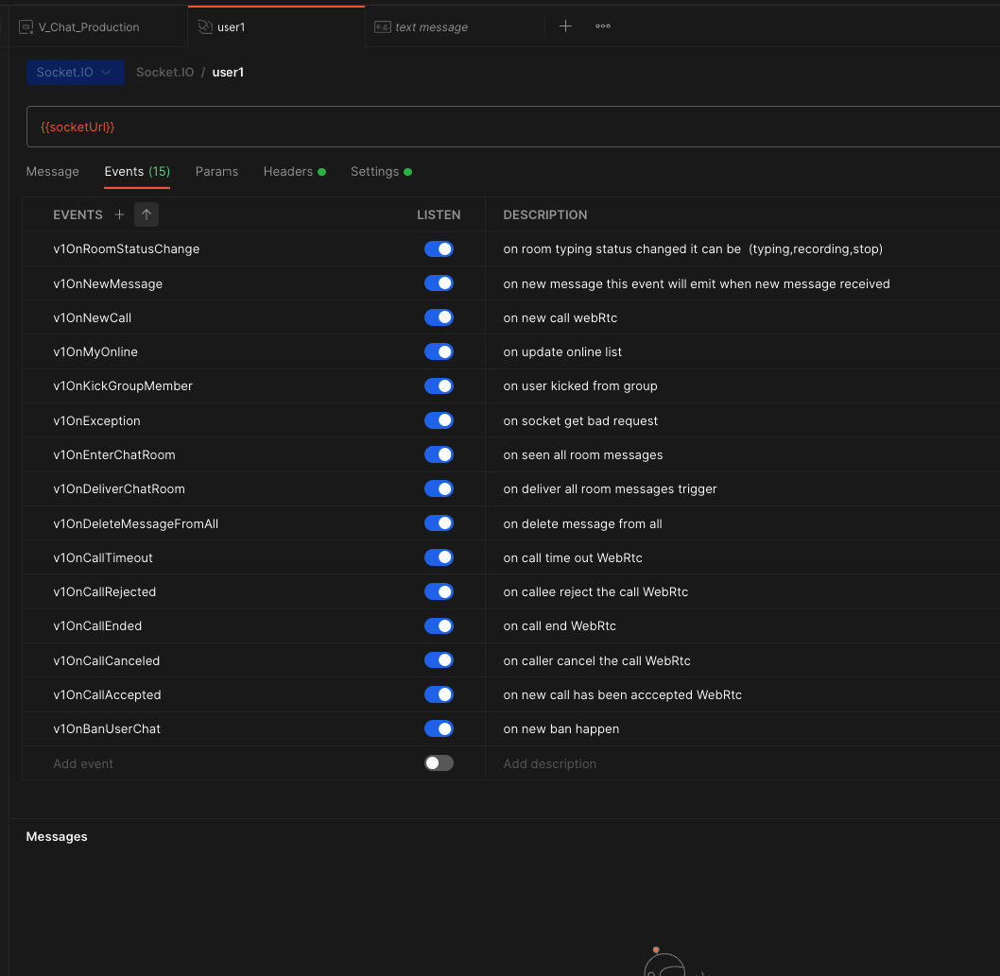

In this section, we will explain all socket.io events used by V Chat and their respective responses.

- to connect to the socket you need to make sure you use socket `clint v4`
- add the auth to the `headers`


  
### Client Listener (socket.on('EVENT'))

#### 1. `v1OnNewMessage`

Triggered when a new message is received. The response is a JSON object containing information about the message, including sender information, room information, content, and timestamps.
```json
{
  "sId": "63d6683a88c3d52e0e6dffa4",
  "sIdentifier": "user1@gmail.com",
  "sName": "user 1",
  "sImg": "https://super-up-vchat.s3.eu-west-3.amazonaws.com/v-public/63d6683a88c3d52e0e6dffa4/pic100-063399d5-1dfb-4751-b392-59d3c0a4b5c0.jpg",
  "plm": "other",
  "rId": "63ebe4e6ed30938bc1d9203c",
  "c": "1111111111111",
  "isEncrypted": false,
  "mT": "text",
  "msgAtt": null,
  "rTo": null,
  "sAt": null,
  "dAt": null,
  "forId": null,
  "dltAt": null,
  "pBId": null,
  "dF": [],
  "stars": [],
  "lId": "447bc1aa-bbf4-4de6-bc43-19d349398f02",
  "linkAtt": null,
  "peerData": null,
  "_id": "6406443f14eb1e120ecd9007",
  "createdAt": "2023-03-06T19:51:27.582Z",
  "updatedAt": "2023-03-06T19:51:27.582Z"
}
```
#### 2. `v1OnBanUserChat`

Triggered when a user is banned from the chat. The response contains information about the user who was banned and the room they were banned from.

```json
{
  "isMeBanner": true,
  "isPeerBanner": false,
  "roomId": "roomId"
}
```

#### 3. `v1OnDeleteMessageFromAll`

Triggered when a message is deleted for all users. The response is a normal message object with the `dltAt` field containing the time the message was deleted.
```json
{
  "sId": "63d6683a88c3d52e0e6dffa4",
  "sIdentifier": "user1@gmail.com",
  "sName": "user 1",
  "sImg": "https://super-up-vchat.s3.eu-west-3.amazonaws.com/v-public/63d6683a88c3d52e0e6dffa4/pic100-063399d5-1dfb-4751-b392-59d3c0a4b5c0.jpg",
  "plm": "other",
  "rId": "63ebe4e6ed30938bc1d9203c",
  "c": "1111111111111",
  "isEncrypted": false,
  "mT": "text",
  "msgAtt": null,
  "rTo": null,
  "sAt": null,
  "dAt": null,
  "forId": null,
  "dltAt": "2023-03-06T19:51:27.582Z",
  "pBId": null,
  "dF": [],
  "stars": [],
  "lId": "447bc1aa-bbf4-4de6-bc43-19d349398f02",
  "linkAtt": null,
  "peerData": null,
  "_id": "6406443f14eb1e120ecd9007",
  "createdAt": "2023-03-06T19:51:27.582Z",
  "updatedAt": "2023-03-06T19:51:27.582Z"
}
```
#### 4. `v1OnKickGroupMember`

Triggered when a group member is kicked. The response contains information about the user who was kicked and the room they were kicked from.

```json
{
  "roomId": "roomId",
  "userId": "userId"
}
```

#### 5. `v1OnMyOnline`

Triggered when the online status of users changes. The response contains an array of objects, each object representing a user's online status.

```json
[
  {
    "peerId": "peerId",
    "isOnline": true
  },
  {
    "peerId": "peerId2",
    "isOnline": false
  }
]
```

#### 6. `v1OnRoomStatusChange`

Triggered when the room status changes. The status can be an enum of `(stop, typing, recording)`. The response contains information about the user who changed the status and the room the status was changed in.

```json
{
  "name": "name",
  "status": "status",
  "userId": "userId",
  "roomId": "roomId"
}
```

#### 7. `v1OnDeliverChatRoom`

Triggered when a chat room is delivered. The response contains information about the room, the user, and the date of delivery.

```json
{
  "roomId": "roomId",
  "userId": "userId",
  "date": "date"
}
```

#### 8. `v1OnException`

Triggered when an exception occurs. The response contains the error message.

```json
{
  "error": "error"
}
```

#### 9. `v1OnEnterChatRoom`

Triggered when a user enters a chat room. The response contains information about the room, the user, and the date of entry.

```json
{
  "roomId": "roomId",
  "userId": "userId",
  "date": "date"
}
```

### Call Events (only if you use `vChatWebRtc`)

1. `v1OnCallAccepted`
2. `v1OnCallEnded`
3. `v1OnCallCanceled`
4. `v1OnCallRejected`
5. `v1OnNewCall`
6. `v1OnCallTimeout`
7. `v1OnIceCandidate`

